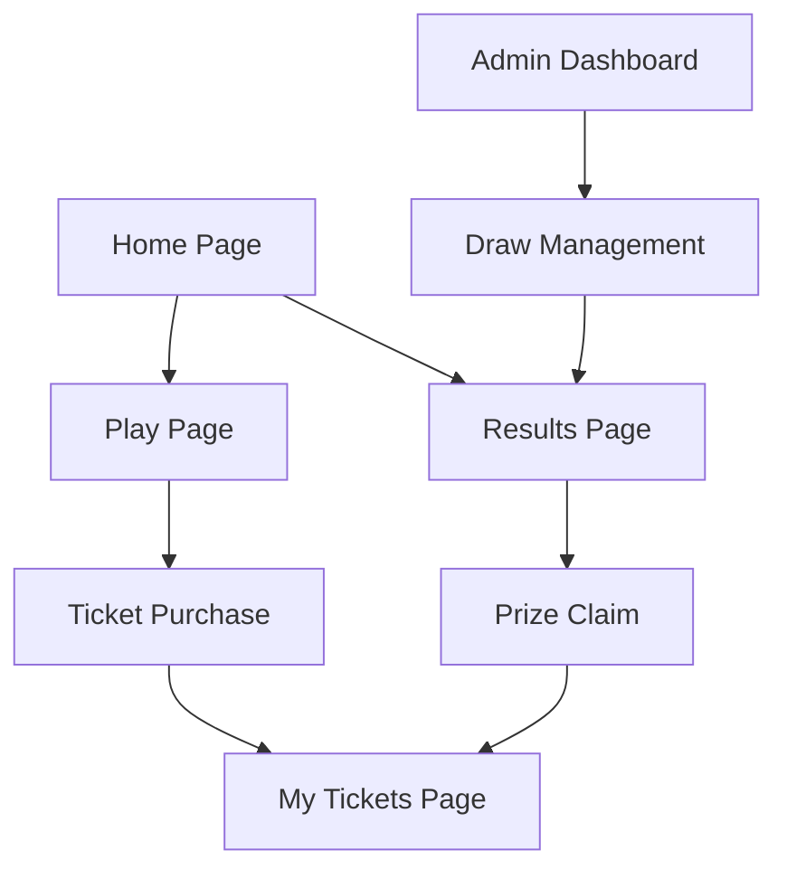

# KasDraw - Decentralized Lottery DApp Product Requirements Document

## 1. Product Overview
KasDraw is a decentralized lottery application built on Kasplex EVM testnet, featuring multiple prize tiers, rollover mechanics, and transparent blockchain-based draws.
- Solves the trust issues in traditional lotteries by using smart contracts for transparent, tamper-proof lottery operations with guaranteed payouts.
- Target users include crypto enthusiasts and lottery players seeking fair, decentralized gaming experiences.
- Aims to showcase the capabilities of Kasplex EVM while providing an engaging lottery platform with Kaspa-themed branding.

## 2. Core Features

### 2.1 User Roles
| Role | Registration Method | Core Permissions |
|------|---------------------|------------------|
| Player | MetaMask wallet connection | Can purchase tickets, view draws, claim prizes |
| Admin | Predefined wallet address | Can trigger draws, manage lottery parameters, collect admin fees |

### 2.2 Feature Module
Our lottery dapp consists of the following main pages:
1. **Home page**: hero section with current jackpot, how to play guide, recent winners display, lottery countdown timer.
2. **Play page**: ticket purchase interface, number selection grid, ticket history, current entries display.
3. **Results page**: draw history, winning numbers display, prize breakdown, winner verification.
4. **My Tickets page**: personal ticket history, prize claims interface, winning status tracking.
5. **Admin Dashboard**: draw management, lottery configuration, fee collection, system statistics.

### 2.3 Page Details
| Page Name | Module Name | Feature description |
|-----------|-------------|---------------------|
| Home page | Hero Section | Display current jackpot amount, next draw countdown, call-to-action buttons |
| Home page | How to Play Guide | Step-by-step instructions, lottery rules explanation, prize structure |
| Home page | Recent Winners | Latest winning numbers, prize amounts, winner addresses (anonymized) |
| Play page | Number Selection | Interactive 6-number grid (1-49), quick pick option, multiple ticket purchase |
| Play page | Ticket Purchase | MetaMask integration, KAS payment processing, ticket confirmation |
| Play page | My Current Entries | Display purchased tickets for current draw, ticket numbers, purchase time |
| Results page | Draw History | Past draw results, winning numbers, prize distributions, draw dates |
| Results page | Prize Verification | Check ticket against winning numbers, prize calculation, claim status |
| My Tickets page | Ticket History | All purchased tickets, win/loss status, prize amounts, claim buttons |
| My Tickets page | Prize Claims | Claim winnings interface, transaction history, pending claims |
| Admin Dashboard | Draw Management | Trigger draws, view participants, generate random numbers, distribute prizes |
| Admin Dashboard | System Configuration | Set ticket prices, adjust prize percentages, manage draw frequency |
| Admin Dashboard | Fee Collection | Collect 1% admin fees, view revenue, withdrawal interface |

## 3. Core Process

**Player Flow:**
1. Connect MetaMask wallet to access the platform
2. Navigate to Play page and select 6 numbers (1-49) or use quick pick
3. Purchase tickets using KAS tokens through smart contract
4. Wait for scheduled draw (twice weekly)
5. Check results on Results page or My Tickets page
6. Claim prizes if winning tickets are found

**Admin Flow:**
1. Access admin dashboard with authorized wallet
2. Monitor ticket sales and participant count
3. Trigger draw at scheduled time using verifiable random function
4. Distribute prizes automatically through smart contract
5. Collect 1% admin fee from total prize pool

## 4. User Interface Design

### 4.1 Design Style
- Primary colors: Kaspa light blue (#00D4E6), turquoise (#40E0D0)
- Secondary colors: Dark blue (#1E3A8A), white (#FFFFFF), light gray (#F8FAFC)
- Button style: Rounded corners (8px), gradient backgrounds, hover animations
- Font: Inter or similar modern sans-serif, sizes 14px-48px
- Layout style: Card-based design, clean navigation bar, responsive grid system
- Icons: Feather icons or Heroicons, lottery-themed custom SVGs

### 4.2 Page Design Overview
| Page Name | Module Name | UI Elements |
|-----------|-------------|-------------|
| Home page | Hero Section | Large jackpot display with animated counter, gradient background (#00D4E6 to #40E0D0), prominent "Play Now" button |
| Home page | How to Play | Step cards with icons, numbered sequence, light blue accents |
| Play page | Number Selection | 7x7 grid of selectable numbers, selected numbers highlighted in Kaspa blue, responsive touch targets |
| Play page | Ticket Purchase | MetaMask connect button, KAS amount display, transaction confirmation modal |
| Results page | Draw History | Timeline layout, winning number balls in Kaspa colors, prize tier breakdown tables |
| My Tickets page | Ticket Display | Card layout for each ticket, color-coded win/loss status, claim buttons in turquoise |
| Admin Dashboard | Control Panel | Dark theme with Kaspa blue accents, data visualization charts, action buttons |

### 4.3 Responsiveness
Desktop-first design with mobile-adaptive breakpoints at 768px and 1024px, touch-optimized number selection grid for mobile devices.